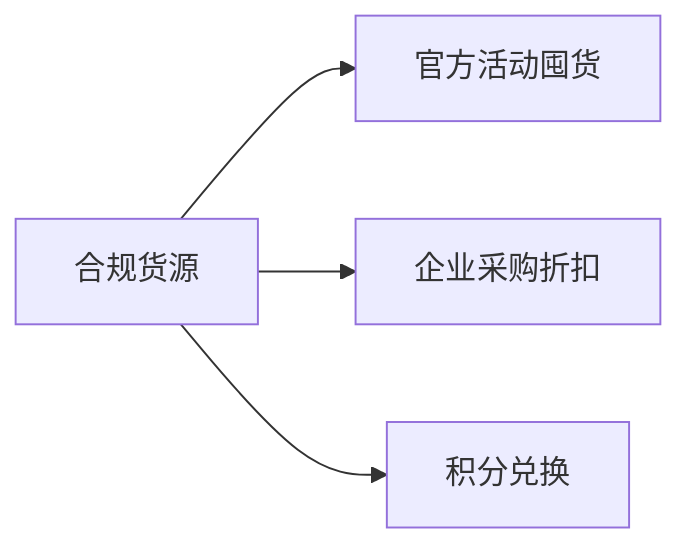

> 🔍 **低价与风险并存，但科学策略可实现安全交易**
> 闲鱼低价会员市场如同“沙里淘金”——**掌握方法才能淘到真金**，盲目跟风可能踩入陷阱。

---

## 一、真实存在的风险：不可忽视的消费陷阱

### 1. 会员中途失效
- **苹果系统退款漏洞**：卖家利用iOS的14天内购退款政策，先充值再退款。用户购买的爱奇艺年卡会员2个月后被收回，维权困难
- **共享账号封禁**：阿里云盘年费会员使用两周后失效，因卖家将同一账号卖给多人导致异常登录

### 2. 资金盗刷骗局
- **免密支付陷阱**：扫码开通免密支付后，1分钟内被连续盗刷299.99元，资金流向B站直播打赏
- **钓鱼链接诈骗**：“0.01元体验会员”链接实为钓鱼网站，苏州用户被盗刷1296元

### 3. 权益不符问题
- **夸克网盘假会员**：99元购买SVIP年卡，实际收到价值8元的淘宝88VIP普通会员，卖家拒绝全款退还
- **数据丢失风险**：购买刷题软件会员后，原有账号被注销，重要学习记录全失

---

## 二、安全交易指南：四步实现“真捡漏”

### ✅ 步骤1：筛选合规卖家（成功率提升80%）
| 指标          | 安全值                | 危险信号                  |
|---------------|----------------------|--------------------------|
| 信用分        | 芝麻信用≥700分       | 未授权/隐藏信用分         |
| 交易历史      | 注册＞1年+真实追评   | 突然转卖虚拟商品          |
| 商品描述      | 明确标注“官方直充”   | 使用“永久会员”等违规词    |

### ✅ 步骤2：识别安全货源渠道

## 三、被骗后的紧急止损方案

| 阶段    | 操作指引                                  |
|---------|------------------------------------------|
| 24小时内| 1. 截图所有交易记录 2. 闲鱼举报+申请信息披露 3. 支付宝关闭免密支付 |

## 四、替代方案：更安全的低价选择

1. **官方活动直购（零风险）**
   - 年度大促：双11腾讯视频年卡88元、618爱奇艺买一送一8
   - 新人福利：首月9.9元试用（无需转卖）

2. **企业渠道共享**
   - Netflix家庭组：官方允许6人共享，人均月费＜15元
   - Adobe正版合租：Adobe官方许可的企业套餐分拆

## 结语：智慧捡漏的核心法则

✨ 闲鱼买会员 = 风险控制能力测试
- 用官方活动价作锚点（如198元年卡大促价99元），低于锚点30%需警惕；
- 用货源透明度作防火墙（索要带订单号的充值记录）；
- 用平台规则作护盾（拒绝任何站外交易要求）。

总之，闲鱼买会员还是挺靠谱的，大多都是官方直充，但是不要贪小便宜，差价过大的还是不要信

> 作为闲鱼会员商家的提醒：不买接码的，链接不要乱点击（特别是付款链接），充值链接只需要提交号码自动充值